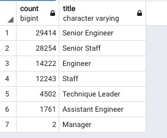
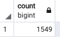
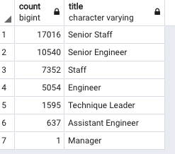
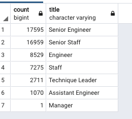

# Pewlett-Hackard-Analysis

# Overview of the analysis

Bobby was given two tasks by his manager to determine the number of retiring employees per title, and also to identify employees who are eligible to participate in a mentorship program. This gives Bobby’s manager to prepare for the “silver tsunami” as many current employees reach retirement age.

# Results

As you can see from 

,

* Highest number of employees retiring are senior engineers
* Only 2 managers are retiring

and from 

* 1549 current employees who were born in the year of 1965 are eligible for mentorship.
* Before applying distict ON, we would see duplicate entries for some employees because they have switched titles over the years

# Summary

## How many roles will need to be filled as the "silver tsunami" begins to make an impact?

As you can see from 

, 

there seems to be a total of 90398 positions to be filled out.

## Are there enough qualified, retirement-ready employees in the departments to mentor the next generation of Pewlett Hackard employees?

There are enough people to train in most of the departments except for managers. There are only 2 managers retiring.

## Additional queries/tables

### Retiring employees earning over 50k

By filtering on the number of employees earning over 50k can help in planning the budget for next quarter to refill those positions

### Retiring employees gender

By filtering on the gender and knowing how many male/female employees are retiring, we can plan gender appropriate return gifts.

